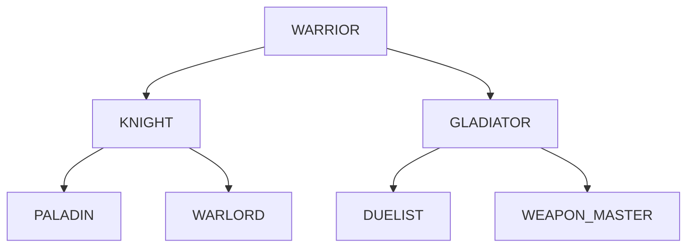
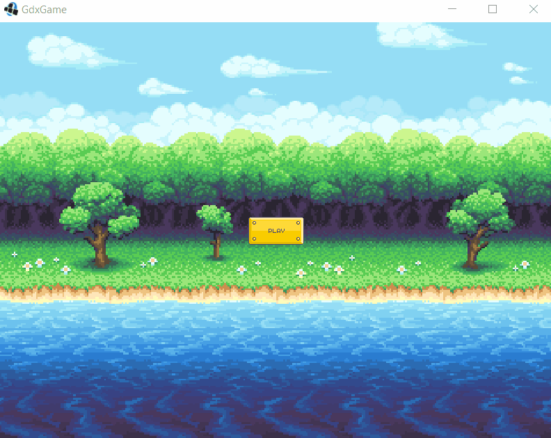
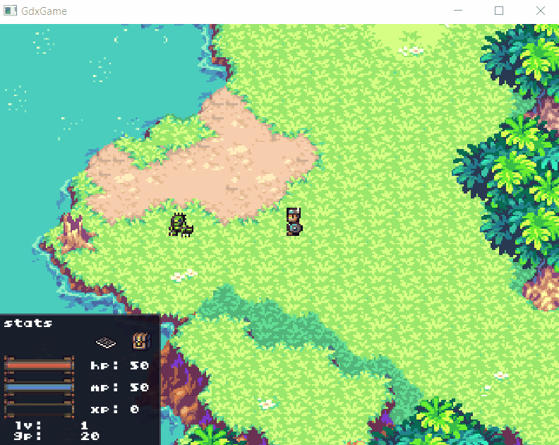

# GdxGame

## Description

This project is based on https://github.com/patrickhoey/BludBourne using LibGDX library. 
It is an RPG 2D base game.

#### Map

The maps are from the Sword of Mana game (GBA) and influenced by the seiken densetsu serie.  
The edition was made with Tiled.exe in order to build layers.

#### Entities
- The hero is an animated 2D sprite.  
The hero moves freely in the maps with the arrow keys or with "WASD".  
The hero will soon be able to interact with NPCs with the "E" key.
- NPCs are also animated 2D sprites.  
You can interact with them by clicking on them at a proper distance. Some have conversations and quests.

#### Battle Screen
The battle system is a turn based fight.  
The screen displays the amount of damage taken and inflicted by the player.  
For now, you can do a basic attack and use objects to restore your health and magic. Later you will be able to choose between a various set of attacks.  

#### Option Screen
The option screen is divided into 3 buttons :  
- The music settings (music is ok / sound is not implemented yet)  
- The control settings  
- A back input, so we can return to the previous screen  

The option screen is triggered on the "O" key.

#### Inventory
The inventory can be displayed through the chest icon on the status UI.  
You can drag and drop items and use consumables by double-clicking on them.

#### Level Up
When you level up (battle, quest), you will be able to display some more extra points to your base stats.  

#### Profiles
The game is saved automatically when a specific action is down (change map, get quest, ...).  
You can chose to start a new game or load an existing profile on the menu screen.

#### Class system
Base class can evolve if you meet the requirements. Each class can upgrade into 2 different classes, which themselves give 2 possible classes  
Upgrading class will grant you different bonuses, from bonus on character stats to weapons stats.  
Example of the class tree system for the warrior :

-------
## Demo

  

gameplay demo

  

battle demo

  
  

demo with the new DA (can't show it on a public repo)

-------
## Game idea
- [ ] add sounds & sounds settings

- [x] battle feature
    - [ ] entities' animation while attacking
    - [ ] ultimate attack cutscene
    - [ ] implement bonus gained by class
    - [ ] implement magic, resist, ... stats

- [ ] armor sets

- [ ] crafting feature

- [ ] credits

- [ ] improve AI

-------
## Bugs

- FadeIn effect not working when transition [menu &#8594; game]
- Drag and drop selection issue on item's render (items are far from mouse when picking them)
- Sometimes current hp/mp on status HUD add a blank space before the max player's hp/mp

&#8855; _Reset position when exiting the game is not properly set when you close the game with the X window button (it is fine when exiting with the ESCAPE key)_

-------
## To improve

- More transition effect
- Z sorting
- Improve collision with Box2D
- Animations on map (opening doors, water, ...)
